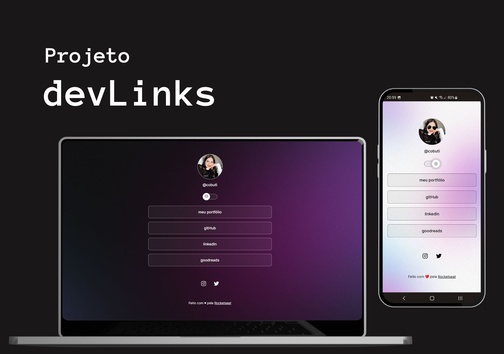

  

## 💻 Projeto

O DevLinks é um agregador de links para usar como cartão de visitas online com a possibilidade de visualização dark mode e light mode.

## 🚀 Tecnologias

- HTML e CSS
- JavaScript
- Git e Github
- Figma

## 💡 Experiências Adquiridas

Através deste projeto disponibilizado pela <a href="https://www.rocketseat.com.br/">RocketSeat</a> pude adquirir os conhecimentos básicos de HTML, CSS, JavaScript e responsividade. Fiz modificações no layout original, usando meu próprio avatar e links.